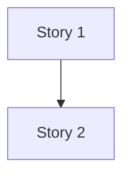

# split-plan - Story 拆分规划

> 本文件是“拆分规划”的**唯一事实来源**：后续 `/split` 与 `/split-check` 必须以此为准，不得自行改 Story 编号/边界/API 归属。
> 低噪音: 只写索引表与依赖图；不要写长段解释；每行尽量一句话。
> 稳定ID: Story 用 `Story N`；接口用 `API-###`；表用 `TBL-###`；规则用 `BR-###`。
> 强约束: 每个 `API-###` 必须且仅能分配给 1 个 Story（禁止一对多/多对一）。

## 1. Story 列表（必须）

| Story | slug | 模块 | 目标（一句话） | 前置Story |
|------|------|------|---------------|----------|
| Story 1 | [kebab-case] | M-01 | [...] | 无 |
| Story 2 | [kebab-case] | M-02 | [...] | Story 1 |

规则：
- `Story` 列必须写成 `Story N`（N 为数字且从 1 递增，不跳号）
- `slug` 用 `kebab-case`，且必须唯一（用于生成 `docs/story-N-slug.md`）
- `模块` 必须是 `M-xx`（可写多个：`M-01,M-02`）
- `前置Story` 只能写 `无` 或 `Story X, Y`

## 2. API 分配表（必须）

| API | Story | 说明 |
|-----|------|------|
| API-001 | Story 1 | [...] |
| API-002 | Story 2 | [...] |

规则：
- PRD `9.2 接口清单` 中出现的每个 `API-###` 必须在此表出现且仅出现一次
- `Story` 列必须引用第 1 节已存在的 `Story N`

## 3. 表分配表（可选；无则写 N/A）

| TBL | Story | 说明 |
|-----|------|------|
| TBL-001 | Story 1 | [...] |
| TBL-002 | Story 2 | [...] |

规则：
- `Story` 列必须引用第 1 节已存在的 `Story N`
- 允许一张表分配给多个 Story（按演进顺序）

## 4. 规则分配（可选；无则写 N/A）

| BR | Story | 说明 |
|----|------|------|
| BR-001 | Story 1 | [...] |
| BR-002 | Story 2 | [...] |

规则：
- 规则优先在 Story 中引用 `GC#BR-###`；这里只做“提示哪些 Story 需要关注哪些规则”

## 5. 依赖图（必须）

规则：
- 依赖必须无环
- 若 `Story A` 依赖 `Story B`，必须满足 `B < A`（可按 `/story 1..N` 顺序执行）

## 6. 自检结果（必须）

- `P0` 模块覆盖：PASS/FAIL（FAIL 时列出未覆盖的 `M-xx`）
- `API-###` 覆盖与唯一分配：PASS/FAIL（FAIL 时列出未分配或重复分配的 `API-###`）
- 依赖合法性：PASS/FAIL（FAIL 时列出环/违规顺序的链路）

