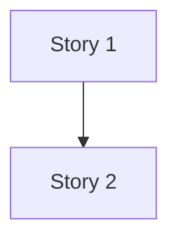

# split-plan - Story 拆分规划

## 1. Story 列表（必须）

| Story | slug | 模块 | 目标（一句话） | 前置Story |
|------|------|------|---------------|----------|
| Story 1 | [kebab-case] | M-01 | [...] | 无 |
| Story 2 | [kebab-case] | M-02 | [...] | Story 1 |

## 2. API 分配表（必须）

| API | Story | 说明 |
|-----|------|------|
| API-### | Story N | [...] |

## 3. 表分配表（可选；无则写 N/A）

| TBL | Story | 说明 |
|-----|------|------|
| TBL-### | Story N | [...] |

## 4. 规则分配（可选；无则写 N/A）

| BR | Story | 说明 |
|----|------|------|
| BR-### | Story N | [...] |

## 5. 依赖图（必须）

## 6. 自检结果（必须）

- `P0` 模块覆盖：PASS/FAIL（FAIL 时列出未覆盖的 `M-xx`）
- `API-###` 覆盖与唯一分配：PASS/FAIL（FAIL 时列出未分配或重复分配的 `API-###`）
- 依赖合法性：PASS/FAIL（FAIL 时列出环/违规顺序的链路）
