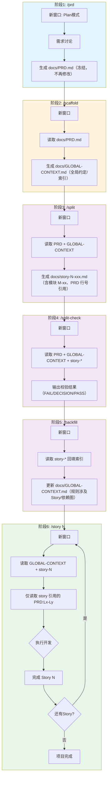

# 🕸️ Textum

把你的想法，编织成可运行的代码。

Textum 是一个帮助你从"我想做一个xxx"到"项目完成"的工作流工具。即使你没有编程经验，也能通过对话一步步把想法变成现实。

## ✨ 它能帮你做什么？



## 📦 安装

把 `.claude` 文件夹放到你的项目里就行了，就这么简单。

## 🎯 六个命令，六个步骤

| 步骤 | 命令 | 做什么 |
|------|------|--------|
| 1️⃣ | `/prd` | 先输入 `/plan` 进入计划模式，再和 AI 聊你想做什么 |
| 2️⃣ | `/scaffold` | 从 PRD 提取全局约定/索引（GLOBAL-CONTEXT） |
| 3️⃣ | `/split` | 把大任务拆成小任务，每个都能独立完成 |
| 4️⃣ | `/split-check` | 严格校验拆分结果（覆盖/依赖/行号） |
| 5️⃣ | `/backfill` | 回填 GLOBAL-CONTEXT 的“规则涉及 Story / 依赖图”索引 |
| 6️⃣ | `/story 1` | 开始做第一个任务！然后 `/story 2`、`/story 3`... |

> 💡 小提示：每个步骤建议开一个新窗口，这样 AI 能更专注；PRD 定稿后就别再改了（后续会引用行号）

## 🧭 执行注意事项（强烈推荐看一遍）

- 一次只跑一个 `/story N`：按顺序跑 `/story 1`、`/story 2`、`/story 3`...
- 如果同一个编号出现多个 `docs/story-N-*.md`：先回到 `/split` 修正，然后重跑 `/split-check` 与 `/backfill`
- Story 声明了“前置 Story”：先完成并合入前置，再做后续（避免并行冲突）
- 实现阶段不发明新规则/新枚举/新接口：发现缺口就停下来问你是否要解冻 PRD 并回到 `/prd`
- 为了省 token：`/story` 只读取 Story 引用的 `PRD:Lx-Ly` 行范围，不要把整份 PRD 粘给 AI

## 📁 文件会放在哪？

```
你的项目/
├── .claude/          # 🔧 工具本身（你下载的）
├── docs/             # 📄 生成的文档都在这
│   ├── PRD.md           # 需求文档（定稿后不要改）
│   ├── GLOBAL-CONTEXT.md # 全局约定/索引（/backfill 回填索引）
│   └── story-1-xxx.md   # 任务清单
└── src/              # 💻 代码会写在这
```

## 🎬 实际使用是这样的

**第一步：聊需求**
```
你：/prd
AI：你好！告诉我你想做一个什么样的应用？
你：我想做一个记账的小程序
AI：好的！这个记账应用是给谁用的呢？...
```

**后面的步骤**
```
你：/scaffold    → AI 自动分析，生成全局上下文
你：/split       → AI 拆分成 5 个小任务
你：/split-check → 严格校验拆分结果
你：/backfill    → 回填依赖图和规则索引
你：/story 1     → 开始第一个任务！
```

## 📏 适合多大的项目？

| 规模 | 功能数 | 实际情况 | 举个例子 |
|------|--------|----------|----------|
| 🌱 小型 | 10-15 | ✅ 可靠完成 | 记账本、待办清单、个人笔记 |
| 🌿 中型 | 15-25 | ⚠️ 需人工校验 | 简单博客、问卷系统 |
| 🌳 较大 | 25-35 | 🧪 理论上限，风险高 | 多角色后台、预约平台 |

> 更大的项目？老实说，建议拆成几个独立子项目 🙏

---

## 🕸️ 为什么叫 Textum？

> *"The Machine 真正强大的地方从来不是某个单点判断，而是它把零散的人、事件和时间编织成了一张网。"*
>
> — 致敬 *Person of Interest*

单独看，每一条信息都没有意义；被织在一起之后，因果才开始显现。

**Textum** 在拉丁语里意味着"被编织成整体的结构"。这个项目扮演的正是这样的角色：它不创造智能，只负责把需求、上下文和故事线编织在一起。

当织网完成，行动的路径就已经存在了。

---

## 📜 License

MIT
