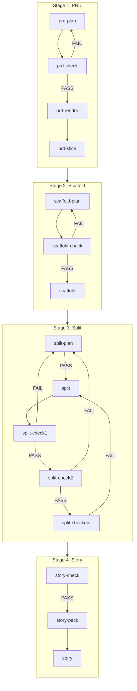

# Textum Workflow

## Workflow Overview



⚠️ Note:
- `story-check` / `story-pack` follow the `next: <stage>` directive in output on `FAIL` (fail-fast routing).

---

## Core Concepts

| Concept | Description |
|---------|-------------|
| **JSON as Single Source of Truth** | `docs/*.json` is the only source of truth; `docs/*.md` are generated views (do not manually edit after generation) |
| **Gates/IDs Handled by Scripts** | Model only writes "confirmed facts"; `*.id` can be `null`, continuity/uniqueness/append-only enforced by scripts |
| **Low-Noise Slicing** | Subsequent bundles only read slice index + files referenced by index, avoiding full file reads |
| **Low-Noise Diagnostic Artifacts** | Each `* check` writes `docs/*-replan-pack.json` + `docs/diagnostics/*.md` (overwritten as latest snapshot); Plan loops prioritize reading these artifacts over long logs |

**Execution Conventions**:
- All commands run from project root
- Recommended to open new window for each stage (avoid context pollution)
- Workflow triggered via `textum` skill routing; script stages run the corresponding `uv run ... textum ...` commands (you may also run them for debugging)
- Default `--fix=true`: Some gate/render/slice commands may write back to `docs/*-pack.json` (only normalize/ID, populate `source/extracted` non-business fields); only outputs `wrote: ...` when actually writing
- Script commands have low-noise stdout: prints `PASS|FAIL`, optional one-line `FAIL/WARN` items (`loc/problem/expected/impact/fix`), optional `wrote:`/`entry:`, then final line `next:`
- `* check` commands also write `docs/*-replan-pack.json` + `docs/diagnostics/*.md` (snapshot for replan loops)
- `DECISION` branches deprecated as user branches: default recorded as WARN (non-blocking); you can ignore WARN when the goal is to keep moving; use `--strict` to upgrade WARN to FAIL for strict gates (currently mainly for Split gate)
- Plan phase: One action per round—either ask questions or write back; if output contains questions, this round does not write back `docs/*-pack.json`

---

## Stage 1: PRD

**Goal**: Requirements clarification → Gate validation → Generate acceptance view → Slice

| Step | Skill | Trigger Intent | Description |
|------|-------|----------------|-------------|
| 1 | `prd-plan` | Requirements clarification / PRD planning | Interactive clarification, write "confirmed facts" to `docs/prd-pack.json` (auto-init on first run) |
| 2 | `prd-check` | Validate PRD / Gate | Gate validation + auto-assign IDs; writes `docs/prd-check-replan-pack.json` + `docs/diagnostics/prd-check.md`; `FAIL` → return to step 1 |
| 3 | `prd-render` | Generate PRD / Render PRD | Generate `docs/PRD.md` (manual acceptance; if not as expected → return to step 1) |
| 4 | `prd-slice` | PRD slicing / slice | Generate `docs/prd-slices/` (required for subsequent Split Plan) |

Recommendation (reduce avoidable loops):
- Before leaving `prd-plan` as `READY`, fill the minimal access model: `roles[]` + `permission_matrix.operations[]` (even for single-user apps; otherwise `prd-check` may `FAIL` and bounce back).

---

## Stage 2: Scaffold

**Goal**: Technical decisions → Gate validation → Generate global context

| Step | Skill | Trigger Intent | Description |
|------|-------|----------------|-------------|
| 1 | `scaffold-plan` | Context extraction / Scaffold planning | Interactive clarification, write "confirmed technical decisions" to `docs/scaffold-pack.json` (auto-init on first run) |
| 2 | `scaffold-check` | Validate GLOBAL-CONTEXT / GC gate | Gate validation + auto-populate extracted/source; writes `docs/scaffold-check-replan-pack.json` + `docs/diagnostics/scaffold-check.md`; `FAIL` → return to step 1 |
| 3 | `scaffold` | Generate GLOBAL-CONTEXT | Generate `docs/GLOBAL-CONTEXT.md` (manual acceptance; if not as expected → return to step 1) |

---

## Stage 3: Split

**Prerequisites**:
- `docs/prd-slices/index.json` exists (PRD Slice completed)
- `docs/scaffold-pack.json` available (Scaffold Check passed)

**Goal**: Story split planning → Gate validation → Generate Story source of truth → Consistency validation → Export dependency graph

| Step | Skill | Description |
|------|-------|-------------|
| 1 | `split-plan` | Interactive clarification + built-in READY gate; define Story boundaries/order, module ownership, API ownership in `docs/split-plan-pack.json`; `split plan check` writes `docs/split-plan-check-replan-pack.json` + `docs/diagnostics/split-plan-check.md`; `PASS` → continue |
| 2 | `split` | Generate `docs/stories/story-###-<slug>.json` |
| 3 | `split-check1` | Structure gate + generate handoff index `docs/split-check-index-pack.json`; threshold defaults to WARN (non-blocking; ok to ignore; `--strict` upgrades to FAIL); writes `docs/split-check1-replan-pack.json` + `docs/diagnostics/split-check1.md`; `FAIL` → return to step 1 (may additionally write `docs/split-replan-pack.json`) |
| 4 | `split-check2` | Reference consistency + completeness gate (`story_count` must match actual file count); writes `docs/split-check2-replan-pack.json` + `docs/diagnostics/split-check2.md`; `FAIL` → return to step 1 |
| 5 | `split-checkout` | Export dependency graph `docs/story-mermaid.md` (for manual order inspection) |

---

## Stage 4: Story

**Prerequisites**:
- `docs/prd-pack.json` available (PRD Check passed)
- `docs/stories/story-###-<slug>.json` exists (Split Generate completed)
- `docs/scaffold-pack.json` contains `extracted.modules_index` (Scaffold Check passed)

**Goal**: Single Story gate → Generate execution bundle → Implement code

| Step | Skill | Input | Description |
|------|-------|-------|-------------|
| 1 | `story-check` | `n` (Story number) | Single Story gate; writes `docs/story-check-replan-pack.json` + `docs/diagnostics/story-check.md`; `FAIL` → route by `next:` |
| 2 | `story-pack` | `n` | Generate low-noise execution bundle `docs/story-exec/story-###-<slug>/index.json`; writes `docs/story-pack-replan-pack.json` + `docs/diagnostics/story-pack.md`; `FAIL` → route by `next:` |
| 3 | `story` | `n` | Read-only execution bundle + minimal on-demand repo code reads; only implement this Story's `feature_points` and `api_endpoints` |
| 4 | `story-full-exec` | `1/2/3` | Batch execution (in order, no rollback) |

---

## Appendix A: Artifact Inventory

| Stage | Source of Truth | Views/Slices |
|-------|-----------------|--------------|
| PRD | `docs/prd-pack.json` | `docs/PRD.md`, `docs/prd-slices/` |
| Scaffold | `docs/scaffold-pack.json` | `docs/GLOBAL-CONTEXT.md` |
| Split | `docs/split-plan-pack.json`, `docs/stories/story-###-<slug>.json` | `docs/split-check-index-pack.json`, `docs/split-replan-pack.json`, `docs/story-mermaid.md` |
| Story | — | `docs/story-exec/story-###-<slug>/index.json` |
| Checks | — | `docs/*-replan-pack.json`, `docs/diagnostics/*.md` |

---

## Appendix B: CLI Usage

> Dependencies isolated in `$SCRIPTS_PATH/.venv`, does not pollute project.
>
> Codex environment: `SCRIPTS_PATH=.codex/skills/textum/scripts`
>
> Claude Code environment: `SCRIPTS_PATH=.claude/skills/textum/scripts`

```bash
uv sync --project $SCRIPTS_PATH              # First time/dependency updates
uv run --project $SCRIPTS_PATH textum <cmd>  # Execute command
```

See Appendix C for specific `<cmd>` options.

---

## Appendix C: Skill → Script Mapping

> Entry point: `$SCRIPTS_PATH/textum/textum_cli.py`

| Skill | CLI Command | Main Implementation |
|-------|-------------|---------------------|
| `prd-plan` | `textum prd init` | `textum/prd_pack.py`, `textum/prd_pack_validate.py` |
| `prd-check` | `textum prd check` | `textum/prd_pack_validate.py` |
| `prd-render` | `textum prd render` | `textum/prd_render.py` |
| `prd-slice` | `textum prd slice` | `textum/prd_slices.py`, `textum/prd_slices_generate.py` |
| `scaffold-plan` | `textum scaffold init` | `textum/scaffold_pack.py` |
| `scaffold-check` | `textum scaffold check` | `textum/scaffold_pack_validate.py` |
| `scaffold` | `textum scaffold render` | `textum/scaffold_render.py` |
| `split-plan` | `textum split plan init/check` | `textum/split_plan_pack.py`, `textum/split_plan_pack_validate.py` |
| `split` | `textum split generate` | `textum/split_story_generate.py` |
| `split-check1` | `textum split check1` | `textum/split_check_index_generate.py`, `textum/split_check_index_pack.py` |
| `split-check2` | `textum split check2` | `textum/split_check_refs.py` |
| `split-checkout` | `textum split checkout` | `textum/split_checkout.py` |
| `story-check` | `textum story check --n <n>` | `textum/story_check.py`, `textum/story_check_utils.py`, `textum/story_check_validate_*.py` |
| `story-pack` | `textum story pack --n <n>` | `textum/story_exec_pack.py`, `textum/story_exec_pack_validate.py` |
| `story` / `story-full-exec` | — | prompt-only (no script) |

Utility commands (non-skill; for atomic writes in Plan phase, avoiding full file reordering):
- `textum prd patch {set|append|delete}` (implementation: `textum/textum_cli_prd_patch.py`, `textum/textum_json_patch.py`)
