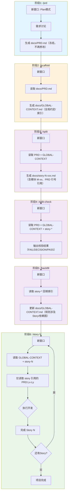

# Textum - PRD → Story 开发工作流（v1）

> 本版本基于 v1 模板体系与约束：规则编号 `BR-###` / 引用 `GC#BR-###`，Story 模板包含 `模块（必填）: M-xx`，并在 `/split` 后加入 `/split-check` 严格校验与 `/backfill` 回填索引。

## 流程图



## 各阶段输入输出

| 阶段 | 命令 | 读取 | 生成/更新 |
|------|------|------|----------|
| 1. 需求定义 | `/prd` | 用户需求 | `docs/PRD.md`（冻结） |
| 2. 脚手架 | `/scaffold` | `docs/PRD.md` | `docs/GLOBAL-CONTEXT.md`（全局约定/索引） |
| 3. Story 拆分 | `/split` | PRD + GLOBAL-CONTEXT | `docs/story-N-xxx.md` |
| 4. 拆分校验 | `/split-check` | PRD + GLOBAL-CONTEXT + 所有 story | 校验报告（不修改文件） |
| 5. 回填索引 | `/backfill` | GLOBAL-CONTEXT + 所有 story | 更新 `docs/GLOBAL-CONTEXT.md` |
| 6. Story 执行 | `/story N` | GLOBAL-CONTEXT + story-N + `PRD:Lx-Ly` | 代码实现 |

## 模板版本（v1）

| 阶段 | 模板 |
|------|------|
| `/prd` | `.claude/textum/PRD-framework-v1.md` |
| `/scaffold` | `.claude/textum/GLOBAL-CONTEXT-template-v1.md` |
| `/split` | `.claude/textum/story-template-v6.md` |

## 目录结构

```
project/
├── .claude/
│   ├── commands/        ← 命令定义
│   └── textum/          ← 模板文件
├── docs/                ← 生成的文档
└── src/                 ← 代码实现
```

## 执行要点（v1）

- 每个阶段使用**新窗口**保持上下文干净
- PRD 一旦定稿就**冻结**：禁止修改 `docs/PRD.md`，确保 `PRD:Lx-Ly` 行号稳定
- GLOBAL-CONTEXT 只放**全局约定/索引**：不得复述模块细节、逐表字段、接口详情；也不得引入 PRD 中不存在的新信息
- 规则编号统一：`BR-###`（001 起递增且唯一）；Story 用 `GC#BR-###` 引用规则，并补充 `PRD:Lx-Ly` 依据
- `/split` 防漏：PRD 接口清单需标注所属 `模块 M-xx`；每个 Story 顶部填写 `模块（必填）: M-xx` 并声明 `前置Story` + `已有资源`
- `/split-check` 严格校验：接口覆盖、规则引用、依赖无环、行号可追溯；未通过不得进入 `/backfill` 与 `/story N`
- `/story N` 控制噪音：先读 `GLOBAL-CONTEXT.md` + `story-N`，只读 Story 引用的 `PRD:Lx-Ly`，避免通读 PRD
