# Textum - PRD → Story 开发工作流（v1）

> 本版本基于 v1 模板体系与约束：规则编号 `BR-###` / 引用 `GC#BR-###`，接口/表提供稳定ID `API-###`/`TBL-###`，并通过 `/prd-check` `/scaffold-check` `/split-check` `/story-check` 降噪与门禁校验。

## 流程图

```mermaid
flowchart TD
    subgraph P1[阶段1: /prd]
        A[新窗口] --> B[需求讨论]
        B --> C[创建/更新 docs/PRD.md（Draft）]
        C --> CC[/prd-check（手动循环校验）/]
        CC -->|PASS| CD[用户手动改 状态: Final（之后不再修改）]
    end

    subgraph P2[阶段2: /scaffold]
        D[新窗口] --> E[读取 docs/PRD.md]
        E --> F[生成 docs/GLOBAL-CONTEXT.md（全局约定/索引）]
        F --> FC[/scaffold-check/]
    end

    subgraph P3A[阶段3a: /split-plan]
        G[新窗口] --> H[读取 PRD 索引章 + GLOBAL-CONTEXT]
        H --> HP[生成 docs/split-plan.md（Story列表+API分配+依赖）]
    end

    subgraph P3[阶段3: /split]
        SP[新窗口] --> SH[读取 split-plan + PRD + GLOBAL-CONTEXT]
        SH --> I[生成 docs/story-N-slug.md（含模块 M-xx、API-###、PRD 行号引用）]
    end

    subgraph P4[阶段4: /split-check]
        SC[新窗口] --> SD[读取 PRD + GLOBAL-CONTEXT + story-*]
        SD --> SE[输出校验结果（FAIL/DECISION/PASS）]
    end

    subgraph P5[阶段5: /backfill]
        BF[新窗口] --> BG[读取 story-* 回填索引]
        BG --> BH[更新 docs/GLOBAL-CONTEXT.md（规则涉及Story/依赖图）]
    end

    subgraph P6[阶段6: /story N]
        J[新窗口] --> JC[/story-check N/]
        JC --> K[读取 GLOBAL-CONTEXT + story-N]
        K --> KP[仅读取 story 引用的 PRD:Lx-Ly（按API/TBL定位）]
        KP --> L{执行开发}
        L --> M[完成 Story N]
        M --> N{还有Story?}
        N -->|是| J
        N -->|否| O[项目完成]
    end

    CD --> D
    FC --> G
    HP --> SP
    I --> SC
    SE --> BF
    BH --> J

    style P1 fill:#e1f5fe
    style P2 fill:#fff3e0
    style P3A fill:#f3e5f5
    style P3 fill:#f3e5f5
    style P4 fill:#f3e5f5
    style P5 fill:#f3e5f5
    style P6 fill:#e8f5e9
```



## 各阶段输入输出

| 阶段 | 命令 | 读取 | 生成/更新 |
|------|------|------|----------|
| 1. 需求定义 | `/prd` | 用户需求 | `docs/PRD.md`（Draft，持续更新） |
| 1b. PRD 校验 | `/prd-check` | `docs/PRD.md` | 校验报告（不修改文件） |
| 2. 脚手架 | `/scaffold` | `docs/PRD.md`（状态: Final） | `docs/GLOBAL-CONTEXT.md`（全局约定/索引） |
| 2b. GC 校验 | `/scaffold-check` | `docs/GLOBAL-CONTEXT.md` | 校验报告（不修改文件） |
| 3a. 拆分规划 | `/split-plan` | PRD（索引章）+ GLOBAL-CONTEXT | `docs/split-plan.md` |
| 3. Story 生成 | `/split` | split-plan + PRD + GLOBAL-CONTEXT | `docs/story-N-slug.md` |
| 4. 拆分校验 | `/split-check` | PRD + GLOBAL-CONTEXT + 所有 story | 校验报告（不修改文件） |
| 5. 回填索引 | `/backfill` | GLOBAL-CONTEXT + 所有 story | 更新 `docs/GLOBAL-CONTEXT.md` |
| 6a. Story 校验 | `/story-check N` | PRD + GLOBAL-CONTEXT + story-N | 校验报告（不修改文件） |
| 6. Story 执行 | `/story N` | GLOBAL-CONTEXT + story-N + `PRD:Lx-Ly` | 代码实现 |

## 模板版本（v1）

| 阶段 | 模板 |
|------|------|
| `/prd` | `.claude/textum/PRD-framework-v1.md` |
| `/scaffold` | `.claude/textum/GLOBAL-CONTEXT-template-v1.md` |
| `/split` | `.claude/textum/story-template-v6.md` |

## 目录结构

```
project/
├── .claude/
│   ├── commands/        ← 命令定义
│   └── textum/          ← 模板文件
├── docs/                ← 生成的文档
└── src/                 ← 代码实现
```

## 执行要点（v1）

- 每个阶段使用**新窗口**保持上下文干净
- PRD 定稿门禁：先跑 `/prd-check` 通过，再由用户手动将 `状态` 改为 `Final`（之后不再修改 `docs/PRD.md`）
- GLOBAL-CONTEXT 只放**全局约定/索引**：不得复述模块细节、逐表字段、接口详情；也不得引入 PRD 中不存在的新信息
- 规则编号统一：`BR-###`（001 起递增且唯一）；Story 用 `GC#BR-###` 引用规则，并补充 `PRD:Lx-Ly` 依据
- 稳定ID：接口用 `API-###`、表用 `TBL-###`；Story 接口必须引用 `API-###` 并给出 `PRD:Lx-Ly`
- `/split-plan` 先做“分配与依赖”，`/split` 再回填 `PRD:Lx-Ly` 行号，减少通读 PRD 的噪音
- `/split-check` 严格校验：`API-###` 覆盖、规则引用、依赖无环、行号/ID一致；未通过不得进入 `/backfill` 与 `/story N`
- `/story-check N` 先做单 Story 门禁，再进入 `/story N` 实现；实现阶段按索引最小读取，避免通读 PRD
- 若 Story 声明 `前置Story`/`已有资源`：先在 `src/` 下用 `rg` 定向检索已有实现，只读取关键签名，避免重复实现
