# Textum - PRD → Story 开发工作流（v2）

> 本版本采用“多窗口 + 低噪音 + 门禁校验”的流程：所有引用一律使用稳定 ID 锚点（`GC#BR-###` / `PRD#API-###` / `PRD#TBL-###` / `PRD#BR-###`），并通过 `/prd-check` `/scaffold-check` `/split-check` `/story-check` 降噪与把关。

## 流程图

```mermaid
flowchart TD
    subgraph P1A[阶段1a: /prd-plan]
        A[新窗口] --> B[需求讨论/澄清]
        B --> BP[输出 PRD_INPUT_PACK（复制交接包）]
    end

    subgraph P1[阶段1b: /prd]
        C[新窗口] --> CP[粘贴 PRD_INPUT_PACK]
        CP -->|信息不足| CQ[输出 PRD_CLARIFY_PACK（不写文件）]
        CP -->|信息足够| D[创建/更新 docs/PRD.md]
    end

    subgraph P1C[阶段1c: /prd-check]
        PC[新窗口] --> CC[/prd-check（手动循环校验）/]
        CC -->|FAIL/DECISION| CR[复制清单回 /prd 修正]
        CC -->|PASS| CD[PRD 只读（后续不修改）]
    end

    subgraph P2[阶段2: /scaffold]
        S2[新窗口] --> E[读取 docs/PRD.md]
        E --> F[生成 docs/GLOBAL-CONTEXT.md（全局约定/索引）]
        F --> FC[/scaffold-check/]
    end

    subgraph P3A[阶段3a: /split-plan]
        G[新窗口] --> H[读取 PRD 索引章 + GLOBAL-CONTEXT]
        H --> HP[生成 docs/split-plan.md（Story列表+API分配+依赖）]
    end

    subgraph P3[阶段3: /split]
        SP[新窗口] --> SH[读取 split-plan + PRD + GLOBAL-CONTEXT]
        SH --> I[生成 docs/story-N-slug.md（含模块 M-xx、PRD#API-###/PRD#TBL-### 引用）]
    end

    subgraph P4[阶段4: /split-check]
        SC[新窗口] --> SD[读取 split-plan + PRD + GLOBAL-CONTEXT + story-*]
        SD --> SE[输出校验结果（FAIL/DECISION/PASS）]
    end

    subgraph P5[阶段5: /backfill]
        BF[新窗口] --> BG[读取 story-* 回填索引]
        BG --> BH[更新 docs/GLOBAL-CONTEXT.md（规则涉及Story/依赖图）]
    end

    subgraph P6[阶段6: /story N]
        J[新窗口] --> JC[/story-check N/]
        JC --> JP[新窗口]
        JP --> JPC[/story-pack N/]
        JPC --> JPO[输出 STORY_EXEC_PACK]
        JPO --> JS[新窗口]
        JS --> JK[/story N（粘贴 STORY_EXEC_PACK）/]
        JK --> L{执行开发}
        L --> M[完成 Story N]
        M --> N{还有Story?}
        N -->|是| J
        N -->|否| O[项目完成]
    end

    CQ --> A
    BP --> C
    D --> PC
    CD --> S2
    FC --> G
    HP --> SP
    I --> SC
    SE --> BF
    BH --> J

    style P1 fill:#e1f5fe
    style P2 fill:#fff3e0
    style P3A fill:#f3e5f5
    style P3 fill:#f3e5f5
    style P4 fill:#f3e5f5
    style P5 fill:#f3e5f5
    style P6 fill:#e8f5e9
```



## 各阶段输入输出

| 阶段 | 命令 | 读取 | 生成/更新 |
|------|------|------|----------|
| 1a. 需求澄清 | `/prd-plan` | 用户需求 / `PRD_CLARIFY_PACK` | `PRD_INPUT_PACK`（复制交接包；不修改文件） |
| 1b. PRD 生成/修正 | `/prd` | `PRD_INPUT_PACK`（可选：`/prd-check` 清单） | `docs/PRD.md`（或输出 `PRD_CLARIFY_PACK`；不修改文件） |
| 1c. PRD 校验 | `/prd-check` | `docs/PRD.md` | 校验报告（不修改文件） |
| 2. 脚手架 | `/scaffold` | `docs/PRD.md`（只读） | `docs/GLOBAL-CONTEXT.md`（全局约定/索引） |
| 2b. GC 校验 | `/scaffold-check` | `docs/GLOBAL-CONTEXT.md` | 校验报告（不修改文件） |
| 3a. 拆分规划 | `/split-plan` | PRD（索引章）+ GLOBAL-CONTEXT | `docs/split-plan.md` |
| 3. Story 生成 | `/split` | split-plan + PRD + GLOBAL-CONTEXT | `docs/story-N-slug.md` |
| 4. 拆分校验 | `/split-check` | split-plan + PRD + GLOBAL-CONTEXT + 所有 story | 校验报告（不修改文件；可能附带 `SPLIT_REPLAN_PACK`） |
| 5. 回填索引 | `/backfill` | GLOBAL-CONTEXT + 所有 story | 更新 `docs/GLOBAL-CONTEXT.md` |
| 6a. Story 校验 | `/story-check N` | PRD + GLOBAL-CONTEXT + story-N | 校验报告（不修改文件） |
| 6b. Story 执行包 | `/story-pack N` | PRD + GLOBAL-CONTEXT + story-N | `STORY_EXEC_PACK`（复制交接包；不修改文件） |
| 6. Story 执行 | `/story N` | `STORY_EXEC_PACK` | 代码实现 |

## 模板文件（当前）

| 阶段 | 模板 |
|------|------|
| `/prd` | `.claude/textum/PRD-framework.md` |
| `/scaffold` | `.claude/textum/GLOBAL-CONTEXT-template.md` |
| `/split-plan` | `.claude/textum/split-plan-template.md` |
| `/split` | `.claude/textum/story-template.md` |

## 目录结构

```
project/
├── .claude/
│   ├── commands/        ← 命令定义
│   └── textum/          ← 模板文件
├── docs/                ← 生成的文档
└── src/                 ← 代码实现
```

## 执行要点（v2）

- 每个阶段使用**新窗口**保持上下文干净
- PRD 只读：`/prd-check` `PASS` 后，后续步骤不修改 `docs/PRD.md`；如需修改，回到 `/prd` 更新并重跑后续步骤
- GLOBAL-CONTEXT 只放**全局约定/索引**：不得复述模块细节、逐表字段、接口详情；也不得引入 PRD 中不存在的新信息
- 规则编号统一：`BR-###`（001 起递增且唯一）；Story 优先用 `GC#BR-###` 引用规则；必要时用 `PRD#BR-###` 引用 PRD
- 稳定ID：接口 `API-###`、表 `TBL-###`；Story 引用 PRD 一律使用 `PRD#<ID>`（如 `PRD#API-001` / `PRD#TBL-001`）
- 无 API：若 PRD `### 9.2 接口清单` 为 `N/A`，则后续不得出现任何 `PRD#API-###`，所有 Story 的“接口”章节写 `N/A`
- `/split-plan` 先做“分配与依赖”，`/split` 再补齐 Story 内的 `PRD#<ID>` 引用，减少通读 PRD 的噪音
- `/split-check` 严格校验：`API-###` 覆盖、规则引用、依赖无环、`PRD#<ID>` 引用可定位；未通过不得进入 `/backfill` 与 `/story N`
- Story 执行顺序：`/story-check N` `PASS` → `/story-pack N` →（新窗口）`/story N`（只使用 `STORY_EXEC_PACK`，不通读 PRD/GC/Story）
- 若 Story 声明 `前置Story`/`已有资源`：先在 `src/` 下用 `rg` 定向检索已有实现，只读取关键签名，避免重复实现
