# Textum - PRD → Story 开发工作流（v5）

> 本版本采用“多窗口 + 低噪音 + 门禁校验”的流程：所有引用一律使用稳定 ID 锚点（`GC#BR-###` / `PRD#API-###` / `PRD#TBL-###` / `PRD#BR-###`），并通过 `/prd-check` `/scaffold-check` `/split-check1` `/split-check2` `/story-check` 降噪与把关。

## 流程图

```mermaid
flowchart TB
    %% 图例：蓝=命令 | 粉=校验 | 黄=文件 | 绿=交接包

    classDef cmd fill:#E3F2FD,stroke:#1E88E5,color:#0D47A1
    classDef chk fill:#FCE4EC,stroke:#D81B60,color:#880E4F
    classDef file fill:#FFFDE7,stroke:#F9A825,color:#6D4C41
    classDef pack fill:#E8F5E9,stroke:#43A047,color:#1B5E20
    classDef dec fill:#EDE7F6,stroke:#5E35B1,color:#311B92
    classDef note fill:#F5F5F5,stroke:#616161,color:#212121

    subgraph B1["1. PRD 阶段"]
        direction LR
        U([用户需求]):::note
        P1[/prd-plan 澄清需求/]:::cmd
        PK1[[INPUT_PACK]]:::pack
        P2[/prd 生成PRD/]:::cmd
        PK2[[CLARIFY_PACK]]:::pack
        F1[(PRD.md)]:::file
        C1{{prd-check}}:::chk

        U --> P1 --> PK1 --> P2
        P2 -.->|信息不足| PK2 -.-> P1
        P2 --> F1 --> C1
        C1 -.->|FAIL| P2
    end

    subgraph B2["2. Scaffold 阶段"]
        direction LR
        S1[/scaffold 抽取上下文/]:::cmd
        F2[(GLOBAL-CONTEXT.md)]:::file
        C2{{scaffold-check}}:::chk

        S1 --> F2 --> C2
        C2 -.->|FAIL| S1
    end

    subgraph B3["3. Split 阶段"]
        direction LR
        SP[/split-plan 规划Story/]:::cmd
        FP[(split-plan.md)]:::file
        SS[/split 生成Story/]:::cmd
        FS[(story-*.md)]:::file
        C3{{split-check1 结构}}:::chk
        IX[(split-check-index-pack.yaml)]:::file
        C4{{split-check2 引用}}:::chk

        SP --> FP --> SS --> FS --> C3
        C3 -.->|规划问题| SP
        C3 -.->|Story问题| SS
        C3 -->|PASS| IX --> C4
        C4 -.->|FAIL| C3
    end

    subgraph B4["4. Story 执行"]
        direction LR
        BF[/backfill 回填索引/]:::cmd
        F3[(GC.md)]:::file
        PK{选择Story}:::dec
        C5{{story-check}}:::chk
        PKG[/story-pack/]:::cmd
        FE[(exec-pack.yaml)]:::file
        EX[/story N 执行/]:::cmd
        MR{还有Story}:::dec
        DN([完成]):::note

        BF --> F3 --> PK --> C5
        C5 -.->|FAIL: 按清单修正后重跑| C5
        C5 -->|PASS| PKG --> FE --> EX --> MR
        MR -->|是| PK
        MR -->|否| DN
    end

    C1 -->|PASS| S1
    C2 -->|PASS| SP
    C4 -->|PASS| BF
```



## 各阶段输入输出

| 阶段 | 命令 | 读取 | 生成/更新 |
|------|------|------|----------|
| 1a. 需求澄清 | `/prd-plan` | 用户需求 / `PRD_CLARIFY_PACK` | `PRD_INPUT_PACK`（复制交接包；不修改文件） |
| 1b. PRD 生成/修正 | `/prd` | `PRD_INPUT_PACK`（可选：`/prd-check` 清单） | `docs/PRD.md`（或输出 `PRD_CLARIFY_PACK`；不修改文件） |
| 1c. PRD 校验 | `/prd-check` | `docs/PRD.md` | 校验报告（不修改文件） |
| 2. 脚手架 | `/scaffold` | `docs/PRD.md`（只读） | `docs/GLOBAL-CONTEXT.md`（全局约定/索引） |
| 2b. GC 校验 | `/scaffold-check` | `docs/GLOBAL-CONTEXT.md` | 校验报告（不修改文件） |
| 3a. 拆分规划 | `/split-plan` | PRD（索引章）+ GLOBAL-CONTEXT | `docs/split-plan.md` |
| 3. Story 生成 | `/split` | split-plan + PRD + GLOBAL-CONTEXT | `docs/story-N-slug.md` |
| 4a. 拆分校验（Core） | `/split-check1` | split-plan + 所有 story | 校验报告；`PASS` 时写入 `docs/split-check-index-pack.yaml`；可能附带 `SPLIT_REPLAN_PACK` |
| 4b. 拆分校验（PRD/GC + API Smoke） | `/split-check2` | `docs/split-check-index-pack.yaml` + PRD + GLOBAL-CONTEXT | 校验报告（不修改文件） |
| 5. 回填索引 | `/backfill` | GLOBAL-CONTEXT + 所有 story | 更新 `docs/GLOBAL-CONTEXT.md` |
| 6a. Story 校验 | `/story-check N` | PRD + GLOBAL-CONTEXT + story-N | 校验报告（不修改文件） |
| 6b. Story 执行包 | `/story-pack N` | PRD + GLOBAL-CONTEXT + story-N | 写入 `docs/story-N-exec-pack.yaml`（`STORY_EXEC_PACK`） |
| 6. Story 执行 | `/story N` | `docs/story-N-exec-pack.yaml` | 代码实现 |

## 模板文件（当前）

| 阶段 | 模板 |
|------|------|
| `/prd` | `.claude/textum/PRD-framework.md` |
| `/scaffold` | `.claude/textum/GLOBAL-CONTEXT-template.md` |
| `/split-plan` | `.claude/textum/split-plan-template.md` |
| `/split` | `.claude/textum/story-template.md` |
| `/split-check1` | `.claude/textum/split-check-index-pack-template.md` |

## 目录结构

```
project/
├── .claude/
│   ├── commands/        ← 命令定义
│   └── textum/          ← 模板文件
├── docs/                ← 生成的文档
└── src/                 ← 代码实现
```

## 执行要点（v2）

- 每个阶段使用**新窗口**保持上下文干净
- PRD 只读：`/prd-check` `PASS` 后，后续步骤不修改 `docs/PRD.md`；如需修改，回到 `/prd` 更新并重跑后续步骤
- GLOBAL-CONTEXT 只放**全局约定/索引**：不得复述模块细节、逐表字段、接口详情；也不得引入 PRD 中不存在的新信息
- 规则编号统一：`BR-###`（001 起递增且唯一）；Story 优先用 `GC#BR-###` 引用规则；必要时用 `PRD#BR-###` 引用 PRD
- 稳定ID：接口 `API-###`、表 `TBL-###`；Story 引用 PRD 一律使用 `PRD#<ID>`（如 `PRD#API-001` / `PRD#TBL-001`）
- 无 API：若 PRD `### 9.2 接口清单` 为 `N/A`，则后续不得出现任何 `PRD#API-###`，所有 Story 的“接口”章节写 `N/A`
- `/split-plan` 先做“分配与依赖”，`/split` 再补齐 Story 内的 `PRD#<ID>` 引用，减少通读 PRD 的噪音
- `/split-check1`（结构/阈值）`PASS` 后运行 `/split-check2`（PRD/GC 对齐；有 API 时 Smoke Test）；未通过不得进入 `/backfill` 与 `/story N`
- FP 覆盖：PRD `8.0 功能点→落点映射` 中的每个 `FP-xx` 必须至少被 1 个 Story 的「关联功能点」覆盖；否则应回到 `/split`（必要时先 `/split-plan`）调整边界
- Story 执行顺序：`/story-check N` `PASS` → `/story-pack N` →（新窗口）`/story N`（只读取 `docs/story-N-exec-pack.yaml`，不通读 PRD/GC/Story）
- 涉及 API 的 Story：`## 测试要求` 不得为 `N/A`（`/story-check` 会 `FAIL`）
- `/story N` 执行后自动跑验证命令：命令来自 `docs/story-N-exec-pack.yaml` 的 `verification.commands`（由 `GLOBAL-CONTEXT` 第 2 节“项目验证命令”抽取）；若全部为 `N/A` 则输出 `DECISION`
- 落点 token：Story 的 `ART:FILE:<path>` / `ART:CFG:<key>` / `ART:EXT:<system>` 必须与 PRD `8.0` 映射中的 `FILE:` / `CFG:` / `EXT:` 精确对齐（`/story-check` 与 `/story-pack` 会做兜底子集校验）
- 若 Story 声明 `前置Story`/`已有资源`：先在 `src/` 下用 `rg` 定向检索已有实现，只读取关键签名，避免重复实现
