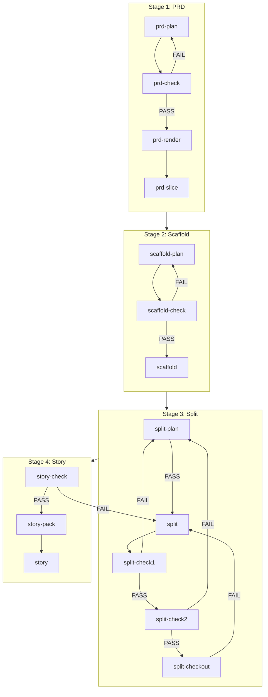

# Textum Workflow (1.0)

> **设计原则**：低噪是硬约束（约束注意力/上下文污染），最终产出符合用户预期是优化目标。

## 流程总览



---

## 核心概念

| 概念 | 说明 |
|------|------|
| **真源只认 JSON** | `docs/*.json` 是唯一事实来源；`docs/*.md` 只是生成视图（生成后不手改） |
| **门禁/ID 交给脚本** | 模型只写"已确认事实"；`*.id` 允许为 `null`，连续性/唯一性/append-only 由脚本自动分配与校验 |
| **低噪切片** | 后续 bundle 默认只读取切片索引 + 被索引引用的少量文件，不通读大文件 |

**运行约定**：
- 所有命令在项目根目录运行
- 推荐每个阶段开新窗口执行（避免上下文污染）
- 流程通过 `textum` skill 路由触发；仅调试时使用 CLI 命令

---

## Stage 命名映射（kebab-case ↔ Title Case）

> `Workflow.md`/mermaid 图中使用 kebab-case（如 `prd-plan`）；`SKILL.md` 与 `references/*.md` 的路由与 `next:` 输出使用 Title Case（如 `PRD Plan`）。两者含义一一对应。

| Workflow/Skill Key | Stage Name（路由/next） | Reference |
|---|---|---|
| `prd-plan` | `PRD Plan` | `.codex/skills/textum/references/prd-plan.md` |
| `prd-check` | `PRD Check` | `.codex/skills/textum/references/prd-check.md` |
| `prd-render` | `PRD Render` | `.codex/skills/textum/references/prd-render.md` |
| `prd-slice` | `PRD Slice` | `.codex/skills/textum/references/prd-slice.md` |
| `scaffold-plan` | `Scaffold Plan` | `.codex/skills/textum/references/scaffold-plan.md` |
| `scaffold-check` | `Scaffold Check` | `.codex/skills/textum/references/scaffold-check.md` |
| `scaffold` | `Scaffold Render` | `.codex/skills/textum/references/scaffold.md` |
| `split-plan` | `Split Plan` | `.codex/skills/textum/references/split-plan.md` |
| `split` | `Split Generate` | `.codex/skills/textum/references/split.md` |
| `split-check1` | `Split Check1` | `.codex/skills/textum/references/split-check1.md` |
| `split-check2` | `Split Check2` | `.codex/skills/textum/references/split-check2.md` |
| `split-checkout` | `Split Checkout` | `.codex/skills/textum/references/split-checkout.md` |
| `story-check` | `Story Check` | `.codex/skills/textum/references/story-check.md` |
| `story-pack` | `Story Pack` | `.codex/skills/textum/references/story-pack.md` |
| `story` | `Story Exec` | `.codex/skills/textum/references/story.md` |
| `story-full-exec` | `Story Full Exec` | `.codex/skills/textum/references/story-full-exec.md` |

---

## Stage 1: PRD

**目标**：需求澄清 → 门禁校验 → 生成验收视图 → 切片

| 步骤 | Skill | 触发意图 | 说明 |
|------|-------|----------|------|
| 1 | `prd-plan` | 需求澄清 / PRD 计划 | 交互澄清，把"已确认事实"写入 `docs/prd-pack.json`（首次自动初始化） |
| 2 | `prd-check` | 校验PRD / 门禁 | 门禁校验 + 自动分配 ID；`FAIL` → 返回步骤 1 |
| 3 | `prd-render` | 生成PRD / 渲染PRD | 生成 `docs/PRD.md`（人工验收；不符合预期 → 返回步骤 1） |
| 4 | `prd-slice` | PRD 切片 / slice | 生成 `docs/prd-slices/`（后续 Split Plan 必需） |

---

## Stage 2: Scaffold

**目标**：技术决策 → 门禁校验 → 生成全局上下文

| 步骤 | Skill | 触发意图 | 说明 |
|------|-------|----------|------|
| 1 | `scaffold-plan` | 上下文提取 / Scaffold 计划 | 交互澄清，把"已确认技术决策"写入 `docs/scaffold-pack.json`（首次自动初始化） |
| 2 | `scaffold-check` | 校验GLOBAL-CONTEXT / GC 门禁 | 门禁校验 + 自动补齐 extracted/source；`FAIL` → 返回步骤 1 |
| 3 | `scaffold` | 生成GLOBAL-CONTEXT | 生成 `docs/GLOBAL-CONTEXT.md`（人工验收；不符合预期 → 返回步骤 1） |

---

## Stage 3: Split

**前置条件**：
- `docs/prd-slices/index.json` 存在（PRD Slice 已完成）
- `docs/scaffold-pack.json` 可用（Scaffold Check 已 PASS）

**目标**：Story 拆分规划 → 门禁校验 → 生成 Story 真源 → 一致性校验 → 导出依赖图

| 步骤 | Skill | 说明 |
|------|-------|------|
| 1 | `split-plan` | 交互澄清 + 内置 READY gate；写清 Story 边界/顺序、模块归属、API 归属到 `docs/split-plan-pack.json`；`PASS/DECISION` → 继续 |
| 2 | `split` | 生成 `docs/stories/story-###-<slug>.json` |
| 3 | `split-check1` | 结构/阈值门禁 + 生成交接索引 `docs/split-check-index-pack.json`；`FAIL` → 返回步骤 1（可能额外写入 `docs/split-replan-pack.json`） |
| 4 | `split-check2` | 引用一致性 + 完整性门禁（`story_count` 必须与实际文件数一致）；`FAIL` → 返回步骤 1 |
| 5 | `split-checkout` | 导出依赖图 `docs/story-mermaid.md`（便于人工检查顺序） |

---

## Stage 4: Story

**前置条件**：
- `docs/stories/story-###-<slug>.json` 存在（Split Generate 已完成）
- `docs/scaffold-pack.json` 包含 `extracted.modules_index`（Scaffold Check 已 PASS）

**目标**：单 Story 门禁 → 生成执行包 → 实现代码

| 步骤 | Skill | 输入 | 说明 |
|------|-------|------|------|
| 1 | `story-check` | `n`（Story 编号） | 单 Story 门禁；`FAIL` → 返回 Split Generate |
| 2 | `story-pack` | `n` | 生成低噪执行包 `docs/story-exec/story-###-<slug>/index.json`；内置自包含门禁 + 预算校验 |
| 3 | `story` | `n` | 只读执行包 + 按需最小化读取 repo 代码；只实现该 Story 的 `feature_points` 与 `api_endpoints` |
| 4 | `story-full-exec` | `1/2/3` | 批量执行（按顺序，不回滚） |

---

## 附录 A: 产物清单

| 阶段 | 真源 | 视图/切片 |
|------|------|-----------|
| PRD | `docs/prd-pack.json` | `docs/PRD.md`、`docs/prd-slices/` |
| Scaffold | `docs/scaffold-pack.json` | `docs/GLOBAL-CONTEXT.md` |
| Split | `docs/split-plan-pack.json`、`docs/stories/story-###-<slug>.json` | `docs/split-check-index-pack.json`、`docs/split-replan-pack.json`、`docs/story-mermaid.md` |
| Story | — | `docs/story-exec/story-###-<slug>/index.json` |

---

## 附录 B: CLI 使用说明

> 依赖隔离在 `$SCRIPTS_PATH/.venv`，不污染项目本体。
>
> Codex 环境：`SCRIPTS_PATH=.codex/skills/textum/scripts`
>
> Claude Code 环境：`SCRIPTS_PATH=.claude/skills/textum/scripts`

```bash
uv sync --project $SCRIPTS_PATH              # 首次/依赖更新
uv run --project $SCRIPTS_PATH textum <cmd>  # 执行命令
```

具体 `<cmd>` 见附录 C。

---

## 附录 C: Skill → 脚本对应

> 入口：`$SCRIPTS_PATH/textum_cli.py`

| Skill | CLI 命令 | 主要实现 |
|-------|----------|----------|
| `prd-plan` | `textum prd init` | `prd_pack.py`、`prd_pack_validate.py` |
| `prd-check` | `textum prd check` | `prd_pack_validate.py` |
| `prd-render` | `textum prd render` | `prd_render.py` |
| `prd-slice` | `textum prd slice` | `prd_slices.py`、`prd_slices_generate.py` |
| `scaffold-plan` | `textum scaffold init` | `scaffold_pack.py` |
| `scaffold-check` | `textum scaffold check` | `scaffold_pack_validate.py` |
| `scaffold` | `textum scaffold render` | `scaffold_render.py` |
| `split-plan` | `textum split plan init/check` | `split_plan_pack.py`、`split_plan_pack_validate.py` |
| `split` | `textum split generate` | `split_story_generate.py` |
| `split-check1` | `textum split check1` | `split_check_index_generate.py`、`split_check_index_pack.py` |
| `split-check2` | `textum split check2` | `split_check_refs.py` |
| `split-checkout` | `textum split checkout` | `split_checkout.py` |
| `story-check` | `textum story check --n <n>` | `story_check.py`、`story_check_utils.py`、`story_check_validate_*.py` |
| `story-pack` | `textum story pack --n <n>` | `story_exec_pack.py`、`story_exec_pack_validate.py` |
| `story` / `story-full-exec` | — | prompt-only（无脚本） |
