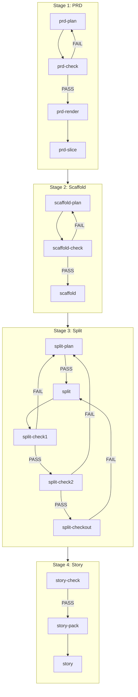

# Textum Workflow

## 流程总览



---

## 核心概念

| 概念 | 说明 |
|------|------|
| **真源只认 JSON** | `docs/*.json` 是唯一事实来源；`docs/*.md` 只是生成视图（生成后不手改） |
| **门禁/ID 交给脚本** | 模型只写"已确认事实"；`*.id` 允许为 `null`，连续性/唯一性/append-only 由脚本自动分配与校验 |
| **低噪切片** | 后续 bundle 默认只读取切片索引 + 被索引引用的少量文件，不通读大文件 |
| **低噪诊断产物** | 每个 `* check` 都写"当前快照"（`docs/*-replan-pack.json` + `docs/diagnostics/*.md`，rerun 会覆盖）。当 `FAIL` 时额外写"保留快照"：`docs/*-replan-pack.last-fail.json` + `docs/diagnostics/*.last-fail.md`。 |

---

## 快速上手指南

**关键运行约定**：
- 所有命令在项目根目录运行
- 推荐每个阶段开新窗口执行（避免上下文污染）
- 流程通过 `textum` skill 路由触发；脚本阶段（init/check/render/slice/...）会执行对应的 `uv run ... textum ...` 命令（你也可手动跑作调试）
- **唯一用户交互点**：`prd-plan`
- **WARN 默认不阻塞**：以推进流程为目标时可忽略 WARN；需要强制收敛时再用 `--strict` 升级 WARN 为 FAIL

**命令输出模式**：
- 脚本命令 stdout 低噪：打印 `PASS|FAIL`、可选的一行式 `FAIL/WARN` items（`loc/problem/expected/impact/fix`）、可选 `wrote:`/`entry:`，最后一行 `next:`

**Plan 阶段行为**：
- `prd-plan` 允许提问或写回
- `scaffold-plan` / `split-plan` 不提问，只根据已确认的 artifacts（`docs/prd-pack.json.workflow_preferences`、`docs/prd-slices/*`）+ 确定性启发式写回，或输出 blockers 回到 `PRD Plan`

---

## Stage 1: PRD

**目标**：需求澄清 → 门禁校验 → 生成验收视图 → 切片

| 步骤 | Skill | 说明 |
|------|-------|------|
| 1 | `prd-plan` | 交互澄清，把"已确认事实"写入 `docs/prd-pack.json`（首次自动初始化） |
| 2 | `prd-check` | 门禁校验 + 自动分配 ID；写诊断产物；`FAIL` → 返回步骤 1 |
| 3 | `prd-render` | 生成 `docs/PRD.md`（人工验收；不符合预期 → 返回步骤 1） |
| 4 | `prd-slice` | 生成 `docs/prd-slices/`（后续 Split Plan 必需） |

**建议**（减少返工回跳）：
- `prd-plan` 在 `READY` 前补齐最小权限模型：`roles[]` + `permission_matrix.operations[]`（即便是单人项目；否则 `prd-check` 容易因缺失而 `FAIL` 回跳）

---

## Stage 2: Scaffold

**目标**：技术决策 → 门禁校验 → 生成全局上下文

| 步骤 | Skill | 说明 |
|------|-------|------|
| 1 | `scaffold-plan` | 无对话计划：从已确认的 `docs/prd-pack.json.workflow_preferences` 写入"已确认技术决策"到 `docs/scaffold-pack.json`（首次自动初始化） |
| 2 | `scaffold-check` | 门禁校验 + 自动补齐 extracted/source；写诊断产物；`FAIL` → 返回步骤 1 |
| 3 | `scaffold` | 生成 `docs/GLOBAL-CONTEXT.md`（人工验收；不符合预期 → 返回步骤 1） |

---

## Stage 3: Split

**前置条件**：
- `docs/prd-slices/index.json` 存在（PRD Slice 已完成）
- `docs/scaffold-pack.json` 可用（Scaffold Check 已 PASS）

**目标**：Story 拆分规划 → 门禁校验 → 生成 Story 真源 → 一致性校验 → 导出依赖图

| 步骤 | Skill | 说明 |
|------|-------|------|
| 1 | `split-plan` | 无对话计划 + 内置 READY gate；启发式：story 数量随 PRD 复杂度（modules/FP/API）推导、deps-first、P0 优先；写入 `docs/split-plan-pack.json`，迭代 replan packs 直到 `PASS` |
| 2 | `split` | 生成 `docs/stories/story-###-<slug>.json` |
| 3 | `split-check1` | 结构门禁 + 生成交接索引 `docs/split-check-index-pack.json`；阈值默认 WARN（不阻塞；可忽略；`--strict` 才升级为 FAIL）；写诊断产物；`FAIL` → 返回步骤 1（可能额外写 `docs/split-replan-pack.json`） |
| 4 | `split-check2` | 引用一致性 + 完整性门禁（`story_count` 必须与实际文件数一致）；写诊断产物；`FAIL` → 返回步骤 1 |
| 5 | `split-checkout` | 导出依赖图 `docs/story-mermaid.md`（便于人工检查顺序） |

---

## Stage 4: Story

**前置条件**：
- `docs/prd-pack.json` 可用（PRD Check 已 PASS）
- `docs/stories/story-###-<slug>.json` 存在（Split Generate 已完成）
- `docs/scaffold-pack.json` 包含 `extracted.modules_index`（Scaffold Check 已 PASS）

**目标**：单 Story 门禁 → 生成执行包 → 实现代码

| 步骤 | Skill | 输入 | 说明 |
|------|-------|------|------|
| 1 | `story-check` | `n`（Story 编号） | 单 Story 门禁；写诊断产物；`FAIL` → 以 `next:` 分流 |
| 2 | `story-pack` | `n` | 生成低噪执行包 `docs/story-exec/story-###-<slug>/index.json`；写诊断产物；`FAIL` → 以 `next:` 分流 |
| 3 | `story` | `n` | 只读执行包 + 按需最小化读取 repo 代码；只实现该 Story 的 `feature_points` 与 `api_endpoints` |
| 4 | `story-full-exec` | `1/2/3` | 批量执行（按顺序，不回滚） |

⚠️ **注意**：`story-check` / `story-pack` 在 `FAIL` 时以输出中的 `next: <stage>` 为准（fail-fast 分流）。

---

## 附录 A: 执行细节

### 运行约定

**默认行为**：
- 默认 `--fix=true`：部分 gate/render/slice 命令可能写回 `docs/*-pack.json`（仅 normalize/ID、补齐 `source/extracted` 等非业务决策字段）；仅在实际写回时才会输出 `wrote: ...`

**诊断产物**：
- `* check` 命令写 `docs/*-replan-pack.json` + `docs/diagnostics/*.md`（当前快照；rerun 会覆盖）
- 当 `FAIL` 时还会写 `docs/*-replan-pack.last-fail.json` + `docs/diagnostics/*.last-fail.md`（保留）

**WARN vs FAIL**：
- WARN 默认不阻塞：把它当作"优化建议"，以推进流程为目标时可忽略
- 用 `--strict` 升级 WARN 为 FAIL（目前主要用于 Split gate）

**Plan 阶段细节**：
- `prd-plan`：交互式，允许提问或写回
- `scaffold-plan` / `split-plan`：无对话，只根据已确认的 artifacts + 确定性启发式写回，或输出 blockers 回到 `PRD Plan`

---

## 附录 B: 产物清单

| 阶段 | 真源 | 视图/切片 |
|------|------|-----------|
| PRD | `docs/prd-pack.json` | `docs/PRD.md`、`docs/prd-slices/` |
| Scaffold | `docs/scaffold-pack.json` | `docs/GLOBAL-CONTEXT.md` |
| Split | `docs/split-plan-pack.json`、`docs/stories/story-###-<slug>.json` | `docs/split-check-index-pack.json`、`docs/split-replan-pack.json`、`docs/story-mermaid.md` |
| Story | — | `docs/story-exec/story-###-<slug>/index.json` |
| Checks | — | `docs/*-replan-pack.json`、`docs/diagnostics/*.md`、`docs/*-replan-pack.last-fail.json`、`docs/diagnostics/*.last-fail.md` |

---

## 附录 C: CLI 使用说明

> 依赖隔离在 `$SCRIPTS_PATH/.venv`，不污染项目本体。
>
> Codex 环境：`SCRIPTS_PATH=.codex/skills/textum/scripts`
>
> Claude Code 环境：`SCRIPTS_PATH=.claude/skills/textum/scripts`

```bash
uv sync --project $SCRIPTS_PATH              # 首次/依赖更新
uv run --project $SCRIPTS_PATH textum <cmd>  # 执行命令
```

具体 `<cmd>` 见附录 D。

---

## 附录 D: Skill → 脚本对应

> 入口：`$SCRIPTS_PATH/textum/textum_cli.py`

| Skill | CLI 命令 | 主要实现 |
|-------|----------|----------|
| `prd-plan` | `textum prd init` | `textum/prd/prd_pack.py`、`textum/prd/prd_pack_validate.py` |
| `prd-check` | `textum prd check` | `textum/prd/prd_pack_validate.py` |
| `prd-render` | `textum prd render` | `textum/prd/prd_render.py` |
| `prd-slice` | `textum prd slice` | `textum/prd/prd_slices.py`、`textum/prd/prd_slices_generate.py` |
| `scaffold-plan` | `textum scaffold init` | `textum/scaffold/scaffold_pack.py` |
| `scaffold-check` | `textum scaffold check` | `textum/scaffold/scaffold_pack_validate.py` |
| `scaffold` | `textum scaffold render` | `textum/scaffold/scaffold_render.py` |
| `split-plan` | `textum split plan init/check` | `textum/split/split_plan_pack.py`、`textum/split/split_plan_pack_validate.py` |
| `split` | `textum split generate` | `textum/split/split_story_generate.py` |
| `split-check1` | `textum split check1` | `textum/split/split_check_index_generate.py`、`textum/split/split_check_index_pack.py` |
| `split-check2` | `textum split check2` | `textum/split/split_check_refs.py` |
| `split-checkout` | `textum split checkout` | `textum/split/split_checkout.py` |
| `story-check` | `textum story check --n <n>` | `textum/story/story_check.py`、`textum/story/story_check_utils.py`、`textum/story/story_check_validate_*.py` |
| `story-pack` | `textum story pack --n <n>` | `textum/story/story_exec_pack.py`、`textum/story/story_exec_pack_validate.py` |
| `story` / `story-full-exec` | — | prompt-only（无脚本） |

辅助命令（非 skill；用于 Plan 阶段做原子写回，避免整文件重排）：
- `textum prd patch {set|append|delete}`（实现：`textum/textum_cli_prd_patch.py`、`textum/textum_json_patch.py`）
